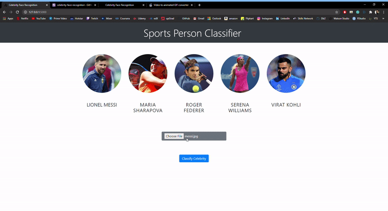

# Celebrity Face Recognition WebApp
 

We classify sports personalities in this data science and machine learning study. We limit the number of people who can be classified to only five. In this model, we first gathered photographs of athletes from the internet, then used OpenCV to crop all of the faces found in the images. The photos were then Wavelets converted to extract the primary characteristic of the faces. The data was then trained using a training set. We explored a number of algorithms before settling on SVM because it produced the best results. Then, as a backend, we built a flask application to handle the input and output.

## Five Celebrities
1. Maria Sharapova
2. Serena Williams
3. Virat Kohli
4. Roger Federer
5. Lionel Messi

## Technologies used in this project
- Python
- Numpy and OpenCV for data cleaning
- Matplotlib & Seaborn for data visualization
- Sklearn for model building
- Jupyter notebook, visual studio code and pycharm as IDE
- Python flask for HTTP server
- HTML/CSS/Javascript for UI

## Deployment
This Model is deployed on Heroku Server
